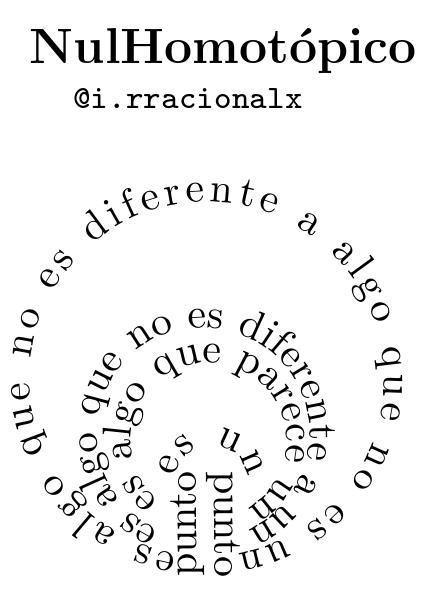

I.rracionalx is a popular science project where I combine poetry and mathemmatical concepts, and each poem is published on the instagram account. Some examples are: the poem of the Mobius strip, the homotopic poem and the elemental operation poem.

The homotopic poem uses the concept of ''null homotopic curves'', the ones that in the space can be deformed into a point without cutting it. Allong Nullhomotópico, we start with a long phrase that can be deformed into a smaller one, without cutting the idea of the initial phrase.

