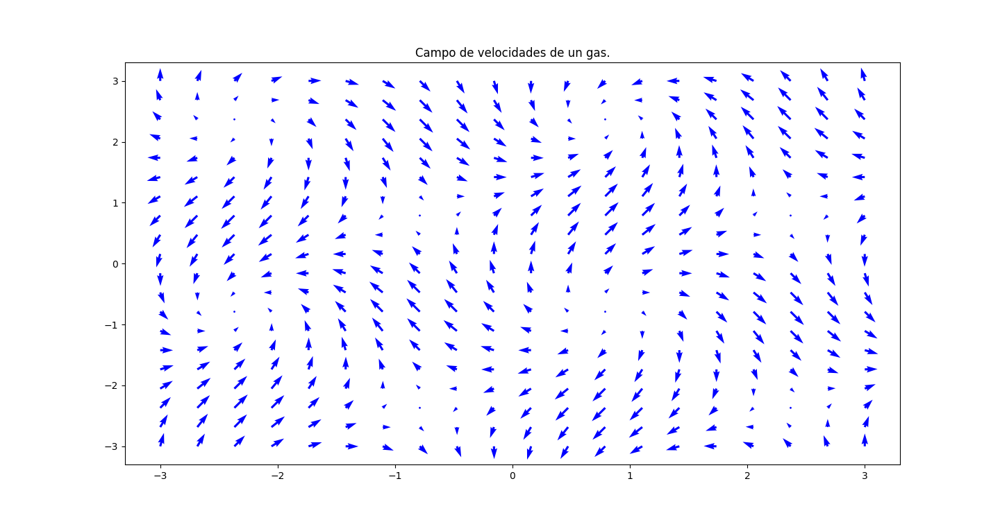

```{r setup, include=FALSE}
options(htmltools.dir.version = FALSE)
knitr::opts_chunk$set(
  fig.show =('asis'),
  dev='png',
	message = FALSE,
	warning = FALSE,
	cache = FALSE,
	hiline = TRUE,
	out.width = "90%"
)
```

```{r xaringan-themer, include=FALSE, warning=FALSE}
library(xaringanthemer)
style_duo_accent(
  primary_color = "#000080",
  secondary_color = "#f2f3f4",
  inverse_header_color = "#00147e"
)
```

```{r xaringan-editable, echo=FALSE}
xaringanExtra::use_editable(expires = 1)
xaringanExtra::use_scribble()
```
# Objetivos:

 * Conocer el concepto de derivada direccional. <br/><br/>
 * Aprender la definición de gradiente, divergencia y rotacional. <br/><br/>
 * Aplicar el gradiente, divergencia y rotacional en problemas físicos. <br/><br/>

---
# Gradiente

> Dada un campo escalar $f:\mathbb{R}^m\to \mathbb{R},$ el gradiente de $f$ (denotado por $\nabla f)$ es el campo vectorial $$\nabla f(\vec{v})=\left(\frac{\partial f}{\partial x_1}(\vec{v}),\cdots,\frac{\partial f}{\partial x_m}(\vec{v})\right).$$

<br/><br/>

El campo asigna a cada vector $v$ el vector de las derivadas de la función en todas las direcciones principales. Hasta el momento, para un campo escalar, el _gradiente_ es lo más cercano a la derivada de la función.

<br/><br/>

__Ejemplo:__ ¿Cuál es el gradiente del campo escalar $f(x,y)=(6x-3y)^5.$

$$\nabla f (x,y)=(30(6x-3y)^4,-15(6x-3y)^4).$$
---
# Ejemplo:

Consideremos el campo escalar _la norma_ de $(x,y,z).$ $$ r(x,y,z)=\sqrt{x^2+y^2+z^2}.$$

Notemos que se cumple: $$ \frac{\partial r}{\partial x}=\frac{x}{\sqrt{x^2+y^2+z^2}}=\frac{x}{r}.$$

Así que el __campo gradiente__ está dado por: $$\nabla r =\frac{\vec{v}}{r}=\frac{x}{r}\mathbf{e}_1+\frac{y}{r}\mathbf{e}_2+\frac{z}{r}\mathbf{e}_3.$$

---
# Ejemplo

Aplicando lo anterior a electroestática, una carga puntual genera un potencial inversamente proporcional a su distancia desde el origen de la carga. 

$$ P=\frac{1}{r}.$$

Utilizando la ley de Coulumb, obtenemos que la fuerza que produce nuestro potencial estará dado por la ecuación:

$$ \mathbf{F}=\frac{1}{r^2}\vec{v}.$$

En general, si el campo escalar es $r^n,$ entonces el campo gradiente está dado por: $$\nabla (r^n)=nr^{n-1}\nabla r.$$

---
# Derivadas Direccionales:

Supongamos que un pájaro vuela en una recta (parametrizada vectorialmente) $\mathbf{x}_0+t\mathbf{v}_0,$ y su altura desde el piso está dada por el campo escalar $f(\mathbf{x}).$ ¿cómo podemos conocer cual es la razón de cambio de la altura durante el vuelo del pájaro?

> La __derivada direccional__ de $f$ en el punto $\mathbf{x}_0$ está dada por el escalar $$\nabla f(\mathbf{x}_0)\cdot \mathbf{v}_0.$$

---
# Direcciones de cambio rapido.

El gradiente nos permite conocer en que dirección (dado un vector base) la función crece rapidamente o decrece rápidamente.

> __Teorema:__ Si $\nabla f(\mathbf{x}_0)\neq \mathbf{0},$ entonces $\nabla f(\mathbf{x}_0)$ es la dirección donde la función crece o decrece más rapidamente.

<iframe src="https://www.geogebra.org/calculator/avqjfgau?embed" width="1200" height="300" allowfullscreen style="border: 1px solid #e4e4e4;border-radius: 4px;" frameborder="0"></iframe>
---
# Divergencia

> Dado un campo vectorial $\mathbf{F}:\mathbb{R}^m\to \mathbb{R}^m,$ definida por la regla de asignación $(f_1,f_2,\cdots,f_m)$. La _divergencia_ del campo está dado por la cantidad escalar $$ \frac{\partial f_1}{\partial x_1}+\frac{\partial f_2}{\partial x_2}+\cdots+\frac{\partial f_m}{\partial x_m}.$$
Usualmente se denota con el símbolo $\nabla\cdot \mathbf{F}$ ó $\mbox{div}\mathbf{F}.$

<br/><br/>

__Nota:__ No confundir la divergencia y el gradiente. El gradiente está definido para campos escalares y da como resultado un campo vectorial. La divergencia está definida para campos vectoriales y da como resultado un campo escalar. 

---
# Interpretación física de la divergencia.

Imaginemos que tenemos un campo $\mathbf{F}$ que mide la velocidad de desplazamiento de particulas de un gas o fluido.

```{python gas-speed, eval=FALSE, include=FALSE}
import numpy as np
import matplotlib.pylab as pl
x,y = np.meshgrid(np.linspace(-3,3,20),np.linspace(-3,3,20))

u = np.sin(x+y)
v = np.cos(x-y)

pl.figure(figsize=(15,10))
pl.quiver(x,y,u,v,scale=7,units="xy",color="blue")
pl.title("Campo de velocidades de un gas.")
pl.show()
```


---
# Divergencia:

> Podemos decir que la divergencia es: <br/><br/>
  - En $\mathbb{R}^2,$ la _razón de expansión del área_ en un campo. <br/><br/>
  - En $\mathbb{R}^3,$ la _razón de expansión del volumen_ en un campo.
  
<br/><br/>
__Ejemplo:__ Calcule divergencia para las siguientes campos vectoriales: $\mathbf{F}_1(x,y)=(x,0),\, \mathbf{F}_2(x,y)=(x,y)$ y $\mathbf{F}_3=(-x,-y).$

---
# El producto cruz o producto vectorial

> El producto vectorial es un campo vectorial que asigna a dos vectores $\mathbf{v}$ y $\mathbf{w},$ un nuevo vector denotado por $\mathbf{v}\times\mathbf{w}.$ En coordenadas esto se ve cómo $$\mathbb{v}\times \mathbb{w} = (v_1,v_2,v_3)\times (w_1,w_2,w_3) =\left| \begin{array}{ccc} e_1 & e_2 & e_3 \\ v_1 & v_2 & v_3 \\ w_1 & w_2 & w_3\end{array}\right|.$$

Algunas propiedades:
  - $\mathbf{v}\times\mathbf{w} = -\mathbf{w}\times\mathbf{v}.$
  - $(k\mathbf{v})\times(l\mathbf{w})=kl\cdot \mathbf{v}\times\mathbf{w}.$
  - $\mathbf{v}\times(\mathbf{w}_1+\mathbf{w}_2)=\mathbf{v}\times \mathbf{w}_1+\mathbf{v}\times \mathbf{w}_2.$
  - Si $\mathbf{v}\times \mathbf{w}=0$ entonces $\mathbf{w}=k\mathbf{v}.$

---
# Ejemplo: 

Calcule el producto cruz  de los vectores los vectores $(1,2,-3)$ y $(-1,4,2).$

---
# Rotacional

> El __rotacional__ de un campo vectorial $\mathbf{F}=(f_1,f_2,f_3),$ es el campo vectorial dado por las reglas de asignación $$\left(\frac{\partial f_3}{\partial y}-\frac{\partial f_2}{\partial z}, \frac{\partial f_1}{\partial z}-\frac{\partial f_3}{\partial x}, \frac{\partial f_2}{\partial x}-\frac{\partial f_1}{\partial y}\right),$$ usualmente se denota con el símbolo $\nabla \times \mathbf{F}$ ó $\mbox{rot}\mathbf{F}.$

---
# Interpretación física del rotacional.

.pull-left[Imaginemos que tenemos el campo vectorial $\mathbf{F}(x,y,z)=(y,-x,0),$ que representa las velocidades de un fluído. ]

```{python eval=FALSE, include=FALSE}
import numpy as np
import matplotlib.pylab as pl
from mpl_toolkits.mplot3d import axes3d

x,y,z = np.meshgrid(np.linspace(-3,3,10),np.linspace(-3,3,10),np.linspace(-1,1,5))

u = y
v = -x
w=0

fig=pl.figure()
ax = fig.gca(projection='3d')
ax.quiver(x,y,z,u,v,w,length=0.1,color="blue")
pl.title("Campo de velocidades de un fluído.")
pl.show()
```
.pull-right[
]
---
# Interpretación física del Rotacional

.pull-left[En una sección de altura, esto se ve cómo:]

```{python eval=FALSE, include=FALSE}
import numpy as np
import matplotlib.pylab as pl
x,y = np.meshgrid(np.linspace(-3,3,10),np.linspace(-3,3,10))

u = y
v = -x

pl.figure(figsize=(15,10))
pl.quiver(x,y,u,v,scale=7,units="xy",color="blue")
pl.title("Campo de velocidades de un gas.")
pl.show()
```
.pull-right[]
Cuando calculamos el rotacional: $$\nabla \times \mathbf{F}= (0,0,-2z).$$