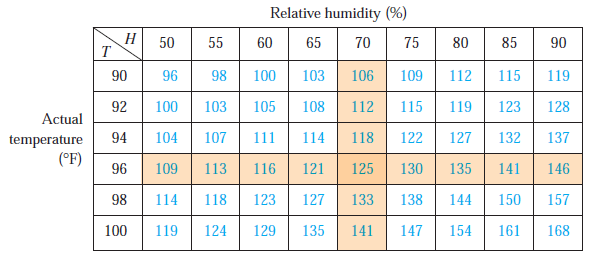

```{r setup, include=FALSE}
options(htmltools.dir.version = FALSE)
knitr::opts_chunk$set(
  fig.width=9, fig.height=3.5, fig.retina=3,
  out.width = "100%",
  cache = FALSE,
  echo = FALSE,
  message = FALSE, 
  warning = FALSE,
  hiline = TRUE
)
```

```{r xaringan-themer, include=FALSE, warning=FALSE}
library(xaringanthemer)
style_duo_accent(
  primary_color = "#000080",
  secondary_color = "#f2f3f4",
  inverse_header_color = "#00147e"
)
```

```{r xaringan-editable, echo=FALSE}
xaringanExtra::use_editable(expires = 1)
xaringanExtra::use_scribble()
```
# Objetivos:

  * Introduciremos las razones de cambio de una función multivariada. <br/><br/>
  * Definiremos el concepto de derivada parcial. <br/><br/>
  * Aplicaremos las reglas generales de derivación parcial. <br/><br/>

---
# Motivación

El __índice de calor__ ($I$) mide los efectos combinados de la temperatura y la humedad. $I$ mide la sensación de la temperatura del aire cuando la temperatura es $T$ y la humedad relativa es $H.$



¿Cuál es la razón de cambio de $I$ cuando variamos $T$ en el punto $(96,70)$?

---
# Derivada Parcial

> __Definición:__ dada una función $f:\mathbb{R}^n\to \mathbb{R},$ la derivada parcial respecto a la variable $x_j,$ denotada por $f_{x_j}=\frac{\partial f}{\partial x_j},$ como el límite $$\lim_{h\to 0} \frac{f(x_1,\cdots,x_j+h,x_{j+1},\cdots, x_n)-f(x_1,\cdots,x_j,x_{j+1},\cdots, x_n)}{h}.$$

--

#### Ejemplo 1: 

Calcule la derivada parcial respecto a $x$ de la función $f(x,y)=3xy.$

--
$$f_x(x,y)=\lim_{h\to 0}\frac{3(x+h)y-3xy}{h}=\lim_{h\to 0}\frac{3(x+h-x)y}{h}=\lim_{h\to 0}\frac{3yh}{h}=3y.$$
---
#### Ejemplo 2:

Calcule la derivada parcial respecto a $y$ de la función $f(x,y,z)=xy-zx+4y.$

--
<br/><br/>
$$f_y(x,y,z)=\lim_{h\to 0}\frac{x(y+h)-zx+4(y+h)-(xy-zx+4y)}{h}=\lim_{h\to 0}\frac{xh+4h}{h}=x+4.$$
--
<br/><br/>
¿Y respecto a $z$?

--
<br/><br/>
$$f_y(x,y,z)=\lim_{h\to 0}\frac{xy-(z+h)x+4y-(xy-zx+4y)}{h}=\lim_{h\to 0}\frac{hx}{h}=x.$$

---
## ¿Cómo Derivar Parcialmente?

> Para derivar parcialmente una función respecto a una variable, basta con derivar la función suponiendo que las demás variables son constantes.

--

#### Ejemplos:

Calcule $f_x,\,f_y$ y $f_z$ para las siguientes funciones: <br/><br/>


* $f(x,y)=\sin(x)+x\cos(y)$
* $f(x,y)=e^{x+y}$
* $f(x,y,z)=x\ln(z)+y\sqrt{x}.$

---
# Visión geométrica de las Derivadas Parciales

Aquí vemos las derivadas parciales de la función $f(x,y)=x^2+xy+y^3$ en el punto $(1,1).$

<iframe src="https://www.geogebra.org/calculator/aemfszpg?embed" width="1200" height="400" allowfullscreen style="border: 1px solid #e4e4e4;border-radius: 4px;" frameborder="0"></iframe>

---
# Modelación con Derivadas Parciales:

> La inflación en Argentina (en 2019) está dadapor la función $h(x,y)=e^{x+y}\sqrt{4-3x^2-2y^2},$ donde $h$ está medida en porcentaje, y $(x,y)$ representa un punto en la ciudad. Si observamos en el punto $(1,1)$ ¿A qué razón cambia la inflación cuando nos movemos en dirección vertical? ¿Y en dirección horizontal?

--

$$\frac{\partial f}{\partial x}=-e^{x + y} \frac{-4 + 3 x + 3 x^2 + 2 y^2}{\sqrt{4 - 3 x^2 - 2 y^2}}$$

$$\frac{\partial f}{\partial x}=-e^{x + y} \frac{3 x^2 + 2 (-2 + y + y^2)}{\sqrt{4 - 3 x^2 - 2 y^2}}$$

---
# Derivación parcial implícita

#### Ejemplo:

Supongamos que $x,y,z$ satisfacen la siguiente ecuación: $$x^2+y^2-z^2=0.$$ Calcule $z_x$ y $z_y.$

--
<br/><br/>
Tenemos que $$\frac{\partial z}{\partial x}=\frac{x}{z}$$ $$\frac{\partial z}{\partial y}=\frac{y}{z}.$$

---
# Propiedades de la Derivada Parcial:

> __Teorema:__ Sea $f,g:\mathbb{R}^n\to\mathbb{R}$ funciones donde $n=2,3.$ Entonces se cumple:
<br/><br/>
  * $(f\pm g)_x=f_x\pm g_x.$ <br/><br/>
  * $(fg)_x = (f_x)g + f(g_x).$ <br/><br/>
  * Si $g\neq 0,$ entonces $(f/g)_x =\frac{(f_x)g-f(g_x)}{g^2}.$

