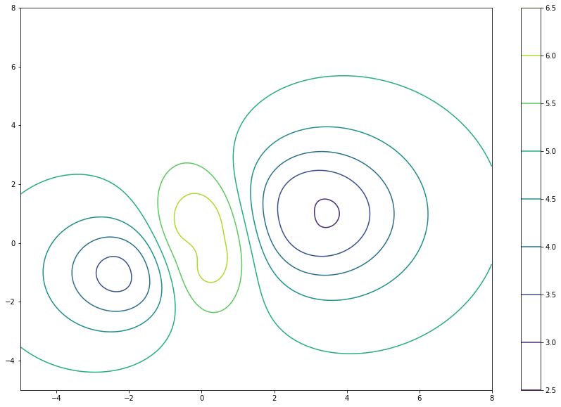

```{r setup, include=FALSE}
options(htmltools.dir.version = FALSE)
knitr::opts_chunk$set(
  fig.width=9, fig.height=3.5, fig.retina=3,
  out.width = "100%",
  cache = FALSE,
  echo = FALSE,
  message = FALSE, 
  warning = FALSE,
  hiline = TRUE
)
```

```{r xaringan-themer, include=FALSE, warning=FALSE}
library(xaringanthemer)
style_duo_accent(
  primary_color = "#000080",
  secondary_color = "#f2f3f4",
  inverse_header_color = "#00147e"
)
```

```{r xaringan-editable, echo=FALSE}
xaringanExtra::use_editable(expires = 1)
xaringanExtra::use_scribble()
```
# Objetivos:

  * Introduciremos el concepto de Derivadas Parciales de Orden superior. <br/><br/>
  * Introduciremos el concepto de vector Gradiente. <br/><br/>
  * Interpretaremos geométricamente al gradiente. <br/><br/>
  * Modelaremos con el gradiente.

---
# Derivadas Parciales de Orden Superior

> Si $f$ es una función de dos variables, entonces $$f_x \mbox{ y } f_y$$ son funciones de varias variables también. Por lo que también podemos encontrar sus derivadas parciales: $$(f_x)_x,\, (f_x)_y,\, (f_y)_x,\, (f_y)_y.$$
Que miden las razones de cambio (parcial) en las razones de cambio.

---
#### Ejemplo:

> Calcule las segundas derivadas parciales de $$f(x,y)=x^3+x^2y^2-2y^2.$$

--
$$f_x(x,y)=3x^2 +2xy^2 \quad f_y(x,y)=2x^2y-4y$$

$$f_{xx}= 6x-2y^2 \quad f_{yx}=4xy$$ 
$$f_{xy}=4xy \quad f_{yy}=2x^2-4$$

---
## Teorema de Clairaut

> __Teorema:__ Supongamos que $f$ está definido en una región de $\mathbb{R}^2$ que contenga al punto $(a,b).$ Si las funciones $f_{xy}$ y $f_{yx}$ son continuas en $D,$ entonces $$f_{xy}(a,b)=f_{yx}(a,b).$$

---
# Gradiente

> __Definición:__ Si $f$ es una función de dos variables $x$ y $y,$ el __gradiente__ de $f$ es el vector (denotado por $\nabla f$ ) definido por $$\nabla f(x,y) =f_x \mathbf{i} +f_y \mathbf{j}.$$

--

#### Ejemplo

> Calcule el gradiente de $f(x,y)=\sin(x)+e^{xy}.$

--
$$\nabla f(x,y)=(\cos(x)+ye^{xy})\mathbf{i}+xe^{xy}\mathbf{j}.$$

---
## Interpretación geométrica del Gradiente

<iframe src="https://www.geogebra.org/classic/fasatszx?embed" width="1000" height="450" allowfullscreen style="border: 1px solid #e4e4e4;border-radius: 4px;" frameborder="0"></iframe>

---
## Algunas Imágenes

#### Gradiente de $f(x,y)=x^2-y^2$


---
#### Gradiente de $f(x,y)=-x^2-y^2$


---

#### Gradiente de $f(x,y)=\cos(x)+e^{xy}$


---
## Gradiente en tres variables

> Si $f(x,y,z)$ es una función, entonces su gradiente está dado por $$\nabla (x,y,z)=f_x\mathbf{i}+f_y\mathbf{j}+f_z\mathbf{k}.$$

--

> __Teorema:__ Si $f$ es una función entonces el camino de máxima crecimiento (decrecimiento) está dado por la indicada por el vector gradiente.

---
# Modelación con el Gradiente

> Supongamos que nos encontramos en el cerro de la silla y que su altura está dada por la siguiente gráfica de curvas de nivel. ¿Que dirección tomaríamos si queremos descender lo más rápido? ¿Y si queremos ascender?

