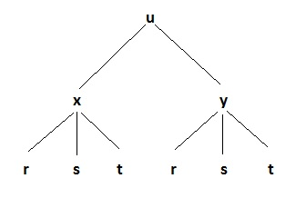

```{r setup, include=FALSE}
options(htmltools.dir.version = FALSE)
knitr::opts_chunk$set(
  fig.width=9, fig.height=3.5, fig.retina=3,
  out.width = "100%",
  cache = FALSE,
  echo = FALSE,
  message = FALSE, 
  warning = FALSE,
  hiline = TRUE
)
```

```{r xaringan-themer, include=FALSE, warning=FALSE}
library(xaringanthemer)
style_duo_accent(
  primary_color = "#000080",
  secondary_color = "#f2f3f4",
  inverse_header_color = "#00147e"
)
```

```{r xaringan-editable, echo=FALSE}
xaringanExtra::use_editable(expires = 1)
xaringanExtra::use_scribble()
```
# Objetivos:

  * Introduciremos el concepto de cambios de variable. <br/><br/>
  * Definiremos la regla de la cadena. <br/><br/>
  * Aplicaremos la regla de la cadena. <br/><br/>

---
# Motivación:

> Consideremos la función $W(T,v)=13.12+0.62T -11.37v^{0.16}+0.39Tv^{0.16}$ que mide la sensación termica del cuerpo donde $T$ es la temperatura y $v$ la velocidad del viento. <br/><br/>
Pero tanto $T$ como $v$ dependen de la posición de la ciudad donde nos encontremos: $$T(x,y)=17+3xy$$ $$v(x,y)=-x^2+y^2$$
<br/><br/>
Por lo que podemos obtener $$V(T(x,y),v(x,y))$$

---
# Cambio de variables

> __Definición:__ Un cambio de variables para una función $f:\mathbb{R}^n\to \mathbb{R}$ es una colección de $n-$funciones $g_1,\cdots,g_n:\mathbb{R}^m\to\mathbb{R}$ tales que $$f(g_1(x_1,\cdots, x_m),g_2(x_1,\cdots, x_m),\cdots,g_n(x_1,\cdots, x_m)).$$

--

#### Ejemplo 1:

Consideremos la función $f(x,y)=xy$ y el cambio de variable $$x(u,v,w)=u+v+w\quad y(u,v,w)=u-v+w$$ Calcula la función $f$ con su cambio de variable.

--

$$f(x(u,v,w),y(u,v,w))=(u+v+w)(u-v+w).$$

---

#### Ejemplo 2:

Consideremos la función $f(x,y)=\ln(x\cos(y^2))$ y el cambio de variable $$x(u,v)=\sin(uv)\quad y(u,v)=e^{uv}$$ Calcula la función $f$ con su cambio de variable.

--
$$ f(x(u,v),y(u,v))=\ln(\sin(uv)\cos(e^{2uv}))$$
---
#### Ejemplo 3:

Consideremos la función $f(x,y,z)=\sqrt{x^2+y^2+z^2}$ y el cambio de variable $$x(u,v)=\sin(u) \quad y(u,v)=\cos(u)\quad z(u,v)=uv$$ Calcula la función $f$ con su cambio de variable.

--
$$ f(x(u,v),y(u,v),z(u,v))=\sqrt{u^2v^2}$$

---
# Regla de la cadena

> __Teorema:__ Supongamos que $u:\mathbb{R}^n\to \mathbb{R}$ es una función de $n-$variables con un cambio de variables $g_1,\cdots,g_n:\mathbb{R}^m\to\mathbb{R}.$ Entonces se cumple que $$\frac{\partial u}{\partial x_j}=\frac{\partial u}{\partial u}\frac{\partial g_2}{\partial x_j}+ \frac{\partial u}{\partial g_2}\frac{\partial g_2}{\partial x_j}+\cdots +\frac{\partial u}{\partial u}\frac{\partial g_n}{\partial x_j}$$ para $j=1,\cdots,m.$

---
 # ¿Cómo se ve la regla de la cadena?
 
 

---

#### Ejemplo 1:

Calcula las derivadas parciales de la función $f(x,y)=xy$ con el cambio de variable $$x(u,v,w)=u+v+w\quad y(u,v,w)=u-v+w.$$

--
$$f_u(u,v,w)=(u-v+w)+(u+v+w)$$ $$f_v(u,v,w)=(u-v+w)-(u+v+w)$$
$$f_w(u,v,w)=(u-v+w)+(u+v+w)$$

---

#### Ejemplo 2:

Calcula las derivadas parciales de la función $f(x,y)=\ln(x\cos(y^2))$ con el cambio de variable $$x(u,v)=\sin(uv)\quad y(u,v)=e^{uv}.$$ 

--

$$ f_u(u,v)=\frac{1}{\sin(uv)}\cos(uv)v+\frac{-2e^{xy}\sin(e^{2uv})}{\sin(uv)\cos(e^{2uv})}ve^{uv}$$