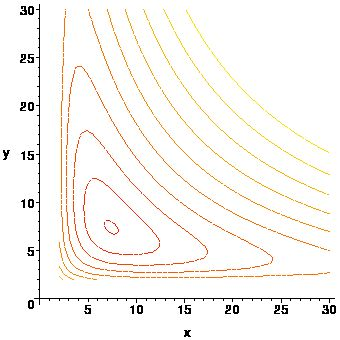

```{r setup, include=FALSE}
options(htmltools.dir.version = FALSE)
knitr::opts_chunk$set(
  fig.width=9, fig.height=3.5, fig.retina=3,
  out.width = "100%",
  cache = FALSE,
  echo = FALSE,
  message = FALSE, 
  warning = FALSE,
  hiline = TRUE
)
```

```{r xaringan-themer, include=FALSE, warning=FALSE}
library(xaringanthemer)
style_duo_accent(
  primary_color = "#000080",
  secondary_color = "#f2f3f4",
  inverse_header_color = "#00147e"
)
```

```{r xaringan-editable, echo=FALSE}
xaringanExtra::use_editable(expires = 1)
xaringanExtra::use_scribble()
```
# Objetivos:

  * Conoceremos como calcular la razón de cambio en direcciones arbitrarias (derivada direccional). <br/><br/>
  * Definiremos la derivada direccional como producto de dos vectores. <br/><br/>
  * Modelaremos utilizando la derivada direccional. <br/><br/>

---
# Motivación

> Las curvas de nivel de la siguiente figura indican la cantidad de humedad respecto a la posición y queremos conocer la razón de cambio de la humedad que se obtiene siguiendo la dirección del huracan.


---
## Motivación visual



---
# Motivación:

> Si $$h(x,y)=\cos(2x^2-xy+y^2)$$ representa la humedad del mapa. Y nos desplazamos en la curva dada por $x(t)=1+3t$ y $y(t)=1+4t$ con $0\leq t\leq 1.$ <br/><br/>
La el cambio de variable $$h(t)=h(x(t)+y(t))=\cos(2(1+3t)^2-(1+3t)(1+4t)+(1+4t)^2)=\cos(22 t^2 + 13 t + 2)$$ mide la humedad en el camino.

---
## Resolviendo

Si calculamos $h_t$ con el cambio de variable obtendremos la razón de cambio de la humedad en el camino. La derivada es $$h_t = h_x x_t+h_y y_t = -\sin(2x^2-xy+y^2)\cdot (4x-y)\cdot 3 - \sin(2x^2-xy+y^2)\cdot (-x+2y)\cdot 4 $$

Cuando evaluamos en $t=0,$ el valor de $x(1)=1$ y $y(1)=1,$ por lo que la razón en el instante $t=0$ es: $$h_t(0)=h_x(1,1)x_t(0)+h_y(1,1)y_t(0)$$
$$=-\sin(2(1)-(1)(1)+(1)^2)\cdot (4(1)-1)\cdot 3 - \sin(2(1)^2-(1)(1)+(1)^2)\cdot (-1+2(1))\cdot 4$$ $$h_t(0)=-13\sin(2)\approx -11.82$$

---
# Derivada direccional

> __Definición:__ Si $(u,v)$ es una dirección en $\mathbb{R}^2,$ $f(x,y)$ es una función y $p=(x_0,y_0)$ entonces la __derivada direccional__ de $f$ en el punto $p$ y dirección $(u,v)$ es la derivada de la función $f$ con el cambio de variable $$x(t)=x_0+ut\quad y(t)=y_0+vt,$$ y se denota por $D_{(u,v)}f(p).$

--


Notemos que $h(t)=f(x(t),y(t))$ tiene como derivada $$h(t)=f_x(x_0,y_0)u+f_y(x_0,y_0)v$$ a este producto especial se le denota por $\nabla f(p)\cdot (u,v).$

---
#### Ejemplos:

> Calcule la derivada de la función $f(x,y)=x^2y^3-4y$ en el punto $(2,-1)$ y en la dirección $(2,5)$.

--


1. Calculamos el vector gradiente $\nabla f$ en el punto $(2,-1):$ $$\nabla f(2,-1)=(2xy^3,3x^2y^2-4)|_{(2,-1)}=(-4,8)$$

2. Calculamos calculamos la derivada direccional $D_{(u,v)}f=\nabla f(2,-1)\cdot (2,5)=(-4)(2)+(-1)(5)$
---
#### Ejemplos:

> Calcule la derivada de la función $f(x,y)=y^2/x$ en el punto $(1,1)$ y en la dirección $(2,1)$.

--


1. Calculamos el vector gradiente $\nabla f$ en el punto $(1,1):$ $$\nabla f(1,1)=\left(-\frac{y^2}{x^2},\frac{2y}{x}\right)|_{(1,1)}=(-1,1)$$

2. Calculamos calculamos la derivada direccional $$D_{(u,v)}f=\nabla f(1,1)\cdot (2,1)=(-1)(2)+(1)(2)$$


---


# ¿Qué pasa si cambiamos la curva que seguimos?

> En el ejemplo tenémos que $x(t)=1+3t$ y $y(t)=1+4t,$ podemos considerar:
<br/><br/>
  * $x(t)=1+\frac{3}{2}t$ y $y(t)=1+2t,$ tenemos que $h_t(0)=\frac{-13\sin(2)}{2}\approx -5.91$ <br/><br/>
  * $x(t)=1+\frac{3}{5}t$ y $y(t)=1+\frac{4}{5}t,$ tenemos que $h_t(0)=-\frac{13 \sin(2)}{5}\approx -2.36$ <br/><br/>
  * $x(t)=1+t$ y $y(t)=1+\frac{4}{3}t,$ tenemos que $h_t(0)=\frac{-13\sin(2)}{3}\approx -3.94$ <br/><br/>
  
---

## Direcciones unitarias

__Nota:__ A partir de ahora, siempre que nos pidan una dirección tomaremos la dirección unitaria del vector. Para esto necesitamos tomar el vector $$\left(\frac{u}{\sqrt{u^2+v^2}},\frac{v}{\sqrt{u^2+v^2}}\right)$$

---
#### Ejemplos:

> Calcule la derivada de la función $f(x,y)=x^4y-4y^2$ en el punto $(2,-1)$ y en la dirección $(2,5)$.

--


1. Primero volvemos unitario mi vector: $$\left(\frac{2}{\sqrt{2^2+5^2}},\frac{5}{\sqrt{2^2+5^2}}\right)=\left(\frac{2}{\sqrt{29}},\frac{5}{\sqrt{29}}\right)$$

2. Calculamos el vector gradiente $\nabla f$ en el punto $(2,-1):$ $$\nabla f(2,-1)=(4x^3y,x^3-8y)|_{(2,-1)}=(32,16)$$

3. Calculamos calculamos la derivada direccional $$D_{(u,v)}f=\nabla f(2,-1)\cdot \left(\frac{2}{\sqrt{29}},\frac{5}{\sqrt{29}}\right)=\frac{(32)(2)+(16)(5)}{\sqrt{29}}$$

---
#### Ejemplos:

> Calcule la derivada de la función $f(x,y)=\frac{\ln(y)}{x-3}$ en el punto $(1,1)$ y en la dirección $(1,1)$.

--


1. Verificamos si mi vector es unitario: $$\left(\frac{1}{\sqrt{1^2+1^2}},\frac{1}{\sqrt{1^2+1^2}}\right)=\left(\frac{1}{\sqrt{2}},\frac{1}{\sqrt{2}}\right)$$

2. Calculamos el vector gradiente $\nabla f$ en el punto $(1,1):$ $$\nabla f(1,1)=\left(-\frac{\ln(y)}{(x-3)^2},\frac{1}{y(x-3)}\right)|_{(1,1)}=\left(0,\frac{-1}{2}\right)$$

2. Calculamos calculamos la derivada direccional 
$$D_{(u,v)}f=\nabla f(1,1)\cdot \left(\frac{1}{\sqrt{2}},\frac{1}{\sqrt{2}}\right)=(0)\left(\frac{1}{\sqrt{2}}\right)+\left(-\frac{1}{2}\right)\left(\frac{1}{\sqrt{2}}\right)$$

---
# Modelación con Derivadas direccionales

> La temperatura en el punto $(x,y,z)$ está dada por $T(x,y,z)=200e^{-x^2-3y^2-9z^2}$ encuentra la razón de cambio en el punto $P(2,-1,2)$ en dirección al punto $(3,-3,3).$

--


1. Hacemos unitaria la dirección $\left(\frac{3}{\sqrt{3^2+(-3)^2+3^2}},\frac{-3}{\sqrt{3^2+(-3)^2+3^2}},\frac{3}{\sqrt{3^2+(-3)^2+3^2}}\right)=\left(\frac{1}{\sqrt{3}},-\frac{1}{\sqrt{3}},\frac{1}{\sqrt{3}}\right)$

2. Calculamos el gradiente en $(2,-1,2)$
$$\nabla f (2,-1,2)=(-400 e^{-x^2 - 3 y^2 - 9 z^2} x, -1200 e^{-x^2 - 3 y^2 - 
   9 z^2} y, -3600 e^{-x^2 - 3 y^2 - 9 z^2) z}|_{(2,-1,2)}$$ $$=(-800e^{-43}, 1200e^{-43}, -7200e^{-43})$$

3. Calculamos la derivada direccional
$$D_{(3,-3,3)}f(2,-1,2)=(-800e^{-43}, 1200e^{-43}, -7200e^{-43})\cdot \left(\frac{1}{\sqrt{3}},-\frac{1}{\sqrt{3}},\frac{1}{\sqrt{3}}\right)$$
