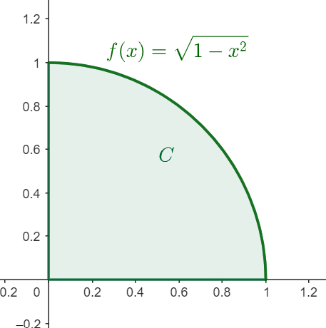

```{r setup, include=FALSE}
options(htmltools.dir.version = FALSE)
knitr::opts_chunk$set(
  fig.show =('asis'),
  dev='png',
	message = FALSE,
	warning = FALSE,
	cache = FALSE,
	hiline = TRUE,
	out.width = "90%"
)
```

```{r xaringan-themer, include=FALSE, warning=FALSE}
library(xaringanthemer)
style_duo_accent(
  primary_color = "#000080",
  secondary_color = "#f2f3f4",
  inverse_header_color = "#00147e"
)
```

```{r xaringan-editable, echo=FALSE}
xaringanExtra::use_editable(expires = 1)
xaringanExtra::use_scribble()
```
# Objetivos:

 * Conocer la definición de coordenadas polares. <br/><br/>
 * Establecer las identidades de cambio de coordenadas. <br/><br/>
 * Mostrar como se afecta la integral en este nuevo sistema de coordenadas.

---
# Motivación:
 ### Coordenadas Polares en $\mathbb{R}^2.$
<iframe src="https://www.geogebra.org/calculator/aubzbhsd?embed" width="1200" height="400" allowfullscreen style="border: 1px solid #e4e4e4;border-radius: 4px;" frameborder="0"></iframe>

---
# El cambio de coordenadas

> Si tenemos un punto $(x,y)$ en $\mathbb{R}^2$ entonces se cumple: <br/><br/>
  * $r=\sqrt{x^2+y^2}$ y $\tan(\theta)= \frac{y}{x}.$ <br/><br/><br/>
  * $x=r\cos(\theta)$ y $y=r\sin(\theta)$

---
## Determinar regiones polares:

> Dadas las siguientes regiones determina si son regiones polares o no.


---
# El diferencial de Área en el nuevo sistem

```{r, echo=FALSE, out.width="60%", fig.cap="Diferencial de área"}
knitr::include_graphics("https://f54648cc-a-62cb3a1a-s-sites.googlegroups.com/site/pesqueriagrupocal/5-calculo-de-varias-variables/integrales-dobles-en-coordenadas-polares/dip%205.png?attachauth=ANoY7crO9XTlPhJdk1W3FnjzKSSzcM8y8zxXDkO_S8slkccFSBJvngN9KLQgCG7eBBwkLciMoyI6Bf8-Lf5AJnSc1H3DJ-9--JOv2xs-Nd-whsCLxc9oee_Fj8TcDZV8m_LsXLI5C6B_w38wCbBO8fOi7_x2QrVW_PKogYdJXLOs5XRfOFaGZw951qmR3cfb6oMq-fwPbYFdFCv1yUqBfysnbm4nPdSUKrFBOvAyFVTosv2vrMqSXqSXUFdV6QP3xDNqSTWNEzGQf2kgycoOm_sUIxh__B35mW1GyG5x4iHd5xTdIJMU8n94X4aUfNbfCtaVl3jpMH1i&attredirects=0
")
```

---
# Apliquemos el cambio de variable en una integral.

> Calcule el área de la región acotada por el eje $x$ y la curva $f(x)=\sqrt{1-x^2}$ utilizando las coordenadas polares.


---
# La adaptación al diferencial de área.

De lo anterior notamos que no es posible calcular integral solo cambiando los datos, hace falta hacer una adecuación. Esta adecuación se hace en el diferencial de área $$dxdy=rdrd\theta.$$
> Calcule el área de la región acotada por el eje $x$ y la curva $f(x)=\sqrt{1-x^2}$ utilizando las coordenadas polares.

---
# Ejemplo:

> Calcule el valor de la integral de $f(x,y)=e^{x^2+y^2}$ en la mitad positiva del circulo unitario.

---
# Ejemplo:

> Calcule el valor de la integral de $f(x,y)=e^{x^2+y^2}$ en la mitad positiva del circulo unitario.

$$\int\int_R e^{x^2+y^2}=\int_0^\pi\int_0^1 e^{r^2} rdrd\theta =\int_0^\pi \left[\frac{1}{2}e^{r^2}\right]_0^1 d\theta = \frac{\pi(e-1)}{2}.$$

---
# Ejercicio:

> Calcula la integral de $f(x,y)=x$ en el cuarto de disco de radio $a$ que se encuentra en el primer cuadrante.

---
# ¿Por qué es mejor calcular la integral con un cambio de variable?

> Intenta calcular la integral $$\int_0^1\int_0^{\sqrt{1-x^2}}x^2+y^2 dydx$$ en coordenadas rectangulares y luego con un cambio de coordenadas.


---

 $C=\{(r,\theta): 0\leq r\leq 1, 0\leq \theta \leq \frac{\pi}{4}\}.$ Por lo que la integral es: $$\int_0^1\int_0^{\pi/4} (r\cos(\theta))^2+(r\sin(\theta))^2 rd\theta dr=\int_0^1\int_0^{\pi/4}r^3d\theta\ dr =\left.\frac{\pi}{4}\frac{r^4}{4}\right|_0^1=\frac{\pi}{4}.$$

---
# Ejemplo:

> Encuentra el volumen del cilindro sólido que se encuentra sobre el circulo unitario y tiene tapa en el paraboloide $z=9-x^2-y^2.$


---
# Ejemplo:

> Encuentre el área de la parte inferior al plano $z=4$ del paraboloide $z=x^2+y^2$ 


