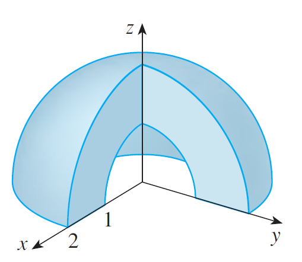

```{r setup, include=FALSE}
options(htmltools.dir.version = FALSE)
knitr::opts_chunk$set(
  fig.show =('asis'),
  dev='png',
	message = FALSE,
	warning = FALSE,
	cache = FALSE,
	hiline = TRUE,
	out.width = "90%"
)
```

```{r xaringan-themer, include=FALSE, warning=FALSE}
library(xaringanthemer)
style_duo_accent(
  primary_color = "#000080",
  secondary_color = "#f2f3f4",
  inverse_header_color = "#00147e"
)
```

```{r xaringan-editable, echo=FALSE}
xaringanExtra::use_editable(expires = 1)
xaringanExtra::use_scribble()
```
# Objetivos:

 * Definir el sistema de coordenadas esféricas. <br/><br/>
 * Determinar el diferencial de volumen en coordenadas esféricas. <br/><br/>
 * Calcular integrales triples en coordenadas esféricas.


---
# Coordenadas Esféricas $(\theta,r,z).$

<iframe src="https://www.geogebra.org/classic/qxudhmhs?embed" width="1200" height="450" allowfullscreen style="border: 1px solid #e4e4e4;border-radius: 4px;" frameborder="0"></iframe>


---
# ¿Cómo traduzco entre coordenadas?

Existen expresiones que nos permiten hacer la conversión entre distintos tipos de coordenadas. Por ejemplo:

> Si tengo un punto $(x,y,z)$ (coordenadas rectangulares) y lo quiero en coordenadas _cilíndricas_, entonces se cumple: <br/>
- $r^2= x^2+y^2+z^2,$ <br/>
- $\theta=\arccos\frac{y}{\sqrt{x^2+y^2}}$ y <br/>
- $\phi=\arcsin\frac{z}{\sqrt{x^2+y^2+z^2}}.$

<br/>

> Si tengo un punto $(\theta,r,z)$ y lo quiero en coordenadas _rectangulares_, entonces se cumple: <br/>
- $x=r\cdot \cos(\theta)\sin(\phi)$ <br/>
- $y=r\cdot \sin(\theta)\sin(\phi)$ y 
- $z=r\cos(\phi).$

---
## Veamos algunas regiones esféricas

> Describa la región en la figura en coordenadas esféricas.



---
## Veamos algunas regiones esféricas

> Describa la región acotada por el cono $z=\sqrt{x^2+y^2}$ y la esfera $x^2+y^2+z^2=z$ en coordenadas esféricas.

---
# ¿Cómo cambia mi diferencial de volumen?

> El diferencial de volumen cambia a $dV=r^2\sin(\phi) d\theta d\phi d r.$
```{r, echo=FALSE, out.width="80%", fig.cap="Diferencial de área"}
knitr::include_graphics("https://files.mtstatic.com/site_4425/5231/0?Expires=1681674231&Signature=WX2~g~I1n1AtsjbMQHHP84KprFsUbI0k3ug3VGxr4AUcRonG76sC8pG1F8EOj~aOjGbt9FXn5rflvBa3iedukxQwy-fuM-~9Fn71JVZ-GTUkrqY2iO0buhgaOyfEVWYW~Z-uIQlxWqwMvb7LZcn6YGLxltC5RgqTGXd-91fMSYU_&Key-Pair-Id=APKAJ5Y6AV4GI7A555NA")
```

---
# Ejemplo:

> Calcule la integral de $f(x,y,z)=9-x^2-y^2$ en la región $R$ dada por el hemisferio $z\geq 0$ y $x^2+y^2+z^2\leq 9.$


---
# Ejemplo:

> Calcule la integral de la función $f(x,y,z)=z$ en la región acotada por las esféras $x^2+y^2+z^2=1$ y $x^2+y^2+z^2=4$ en el primer octante.

---
# Ejemplo

> Calcule el valor de la integral de la función $f(x,y,z)=e^{\sqrt{x^2+y^2+z^2}}$ en el octavo de la esfera $x^2+y^2+z^2=9$ en el primer octante.