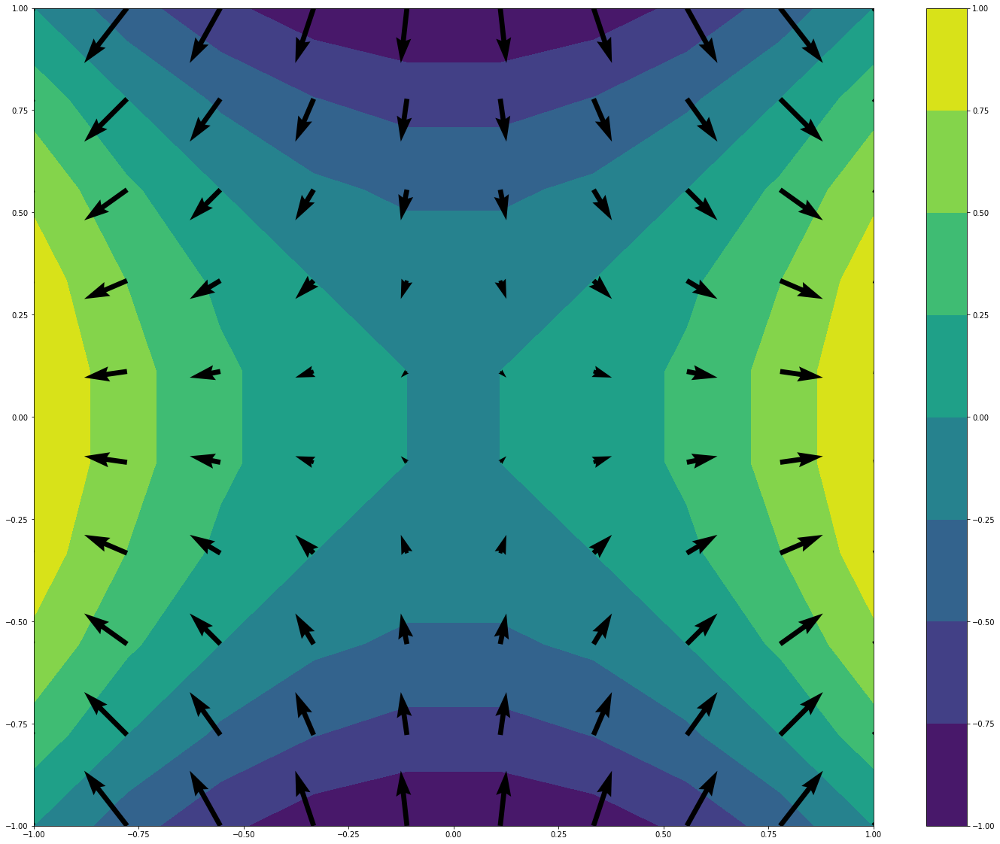
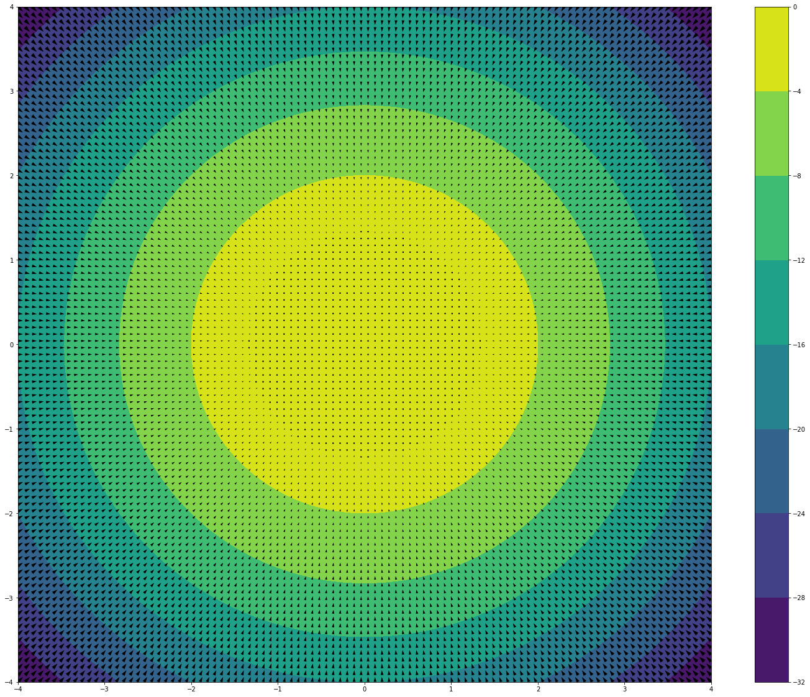
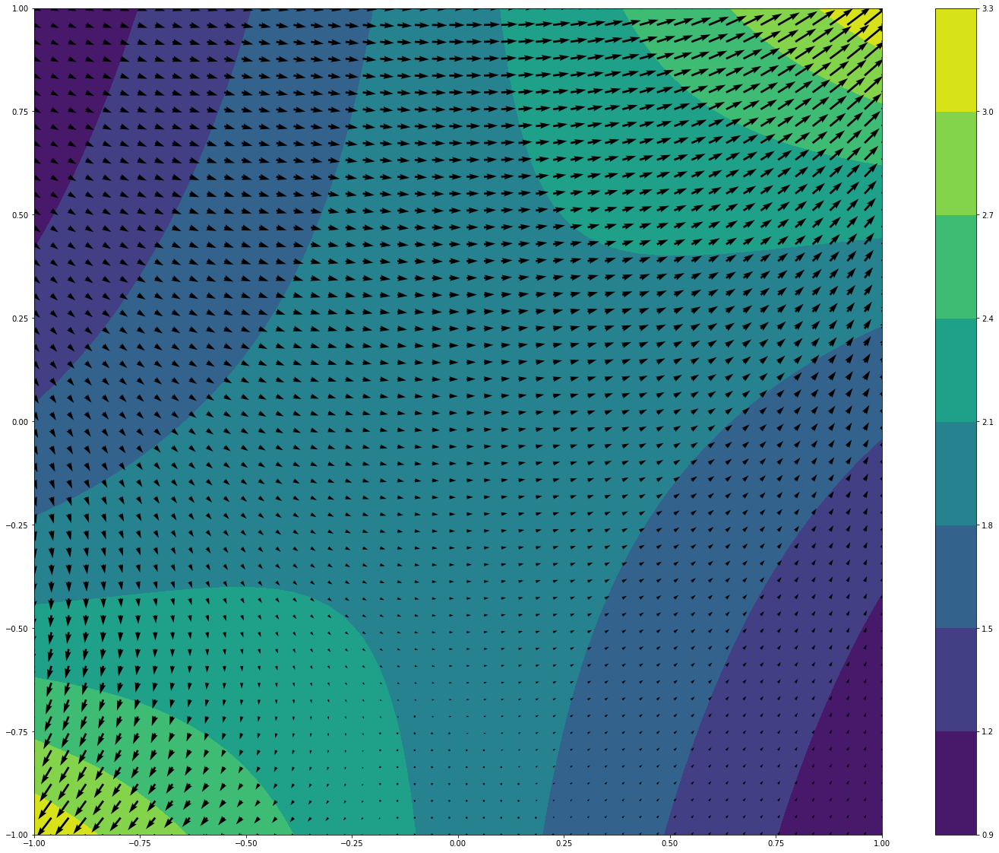

```{r setup, include=FALSE}
options(htmltools.dir.version = FALSE)
knitr::opts_chunk$set(
  fig.width=9, fig.height=3.5, fig.retina=3,
  out.width = "100%",
  cache = FALSE,
  echo = FALSE,
  message = FALSE, 
  warning = FALSE,
  hiline = TRUE
)
```

```{r xaringan-themer, include=FALSE, warning=FALSE}
library(xaringanthemer)
style_duo_accent(
  primary_color = "#000080",
  secondary_color = "#f2f3f4",
  inverse_header_color = "#00147e"
)
```

```{r xaringan-editable, echo=FALSE}
xaringanExtra::use_editable(expires = 1)
xaringanExtra::use_scribble()
```
# Goals for the session

  * Compute higher order partial derivatives. <br/><br/>
  * Deduce what is the gradient of a function. <br/><br/>
  * Geometric interpretation of the gradient. <br/><br/>
  * Modelling with the gradient.

---
# Higher Order Partial Derivatives

> If $f$ is a function of two variables, then $$f_x \mbox{ and } f_y$$ are functions of several variables as well. So we can also find their partial derivatives: $$(f_x)_x,\, (f_x)_y,\, (f_y)_x,\, (f_y)_y.$$ These new partial derivatives are called __second order partial derivatives__ and measure the rate of change of the rate of change.

---
#### Example 1:

> Compute the second derivatives of the function $f(x,y)=x^3+x^2y^2-2y^2.$

--
<br/><br/>
$$f_x(x,y)=3x^2 +2xy^2 \quad f_y(x,y)=2x^2y-4y$$

$$f_{xx}= 6x-2y^2 \quad f_{yx}=4xy$$ 
$$f_{xy}=4xy \quad f_{yy}=2x^2-4$$

---
## Clairaut's Theorem

> **Theorem:** If $f$ is a function of two variables and the second order partial derivatives $f_{xy}$ and $f_{yx}$ are continuous in a region $D,$ then $$f_{xy}=f_{yx}.$$

---
# Gradient Vector

> **Definition:** If $f$ is a function of two variables $x$ and $y,$ the __gradient__ of $f$ is the vector (denoted by $\nabla f$ ) defined by $$\nabla f(x,y) =f_x \mathbf{i} +f_y \mathbf{j}.$$

--

#### Example 2:

> Compute the gradient of $f(x,y)=\sin(x)+e^{xy}.$

--
<br/><br/>
$$\nabla f(x,y)=(\cos(x)+ye^{xy})\mathbf{i}+xe^{xy}\mathbf{j}.$$

---
## Geometric Interpretation of the Gradient

<iframe src="https://www.geogebra.org/classic/fasatszx?embed" width="1000" height="450" allowfullscreen style="border: 1px solid #e4e4e4;border-radius: 4px;" frameborder="0"></iframe>

---
## Some Pictures

#### Gradient of $f(x,y)=x^2-y^2$


<!-- 
 -->


---
#### Gradient of $f(x,y)=-x^2-y^2$


<!-- 
 -->

---

#### Gradient of $f(x,y)=\cos(x)+e^{xy}$

 
---
## Gradient in three variables

> If $f(x,y,z)$ is a function, then its gradient is given by $$\nabla f(x,y,z)=f_x\mathbf{i}+f_y\mathbf{j}+f_z\mathbf{k}.$$

--

> **Theorem:** If $f$ is a function, then the direction of maximum increase of $f$ at a point $(x_0,y_0,z_0)$ is given by the vector $\nabla f(x_0,y_0,z_0).$
---
# Modelling with the Gradient

> Assume that we are in the Chair Hill and the height of the hill is given by the following graph of level curves. What direction would we take if we want to descend as fast as possible? What if we want to ascend?


<!-- 
 -->

