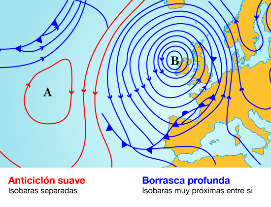

```{r setup, include=FALSE}
options(htmltools.dir.version = FALSE)
knitr::opts_chunk$set(
  fig.width=9, fig.height=3.5, fig.retina=3,
  out.width = "100%",
  cache = FALSE,
  echo = FALSE,
  message = FALSE, 
  warning = FALSE,
  hiline = TRUE
)
```

```{r xaringan-themer, include=FALSE, warning=FALSE}
library(xaringanthemer)
style_duo_accent(
  primary_color = "#000080",
  secondary_color = "#f2f3f4",
  inverse_header_color = "#00147e"
)
```

```{r xaringan-editable, echo=FALSE}
xaringanExtra::use_editable(expires = 1)
xaringanExtra::use_scribble()
```
# Goals of the session

  * Determine how to calculate the rate of change in arbitrary directions (directional derivative). <br/><br/>
  * Define the directional derivative as the product of two vectors. <br/><br/>
  * Model using the directional derivative. <br/><br/>

---
# Motivation

> The following level curves indicate the amount of moisture with respect to position and we want to know the rate of change of moisture obtained by following the direction of the hurricane.



---
## Visual Motivation


---
# Motivation:

> If $$h(x,y)=\cos(2x^2-xy+y^2)$$ represents the humidity of the map. And we move along the curve given by $x(t)=1+3t$ and $y(t)=1+4t$ with $0\leq t\leq 1.$ <br/><br/>
> Then the change of variable $$h(t)=h(x(t)+y(t))=\cos(2(1+3t)^2-(1+3t)(1+4t)+(1+4t)^2)=\cos(22 t^2 + 13 t + 2)$$ measures the humidity along the path. <br/><br/>
> We want to know the rate of change of humidity at the point $(1,1)$ in the direction of the curve.
---
## Solving

If we calculate $h_t$ with the change of variable we will obtain the rate of change of humidity along the path. The derivative is $$h_t = h_x x_t+h_y y_t = -\sin(2x^2-xy+y^2)\cdot (4x-y)\cdot 3 - \sin(2x^2-xy+y^2)\cdot (-x+2y)\cdot 4 $$

When we evaluate at $t=0,$ the value of $x(1)=1$ and $y(1)=1,$ so the rate at time $t=0$ is: $$h_t(0)=h_x(1,1)x_t(0)+h_y(1,1)y_t(0)$$

$$=-\sin(2(1)-(1)(1)+(1)^2)\cdot (4(1)-1)\cdot 3 - \sin(2(1)^2-(1)(1)+(1)^2)\cdot (-1+2(1))\cdot 4$$ $$h_t(0)=-13\sin(2)\approx -11.82$$

---
# Directional Derivative

> **Definition:** If $(u,v)$ is a direction in $\mathbb{R}^2,$ $f(x,y)$ is a function and $p=(x_0,y_0)$, then the __directional derivative__ of $f$ at the point $p$ and direction $(u,v)$ is the derivative of the function $f$ with the change of variable  
$$x(t)=x_0+ut, \quad y(t)=y_0+vt,$$  
and is denoted by $D_{(u,v)}f(p).$

--

<br/><br/>
Note that $h(t)=f(x(t),y(t))$ has as derivative $$h(t)=f_x(x_0,y_0)u+f_y(x_0,y_0)v$$ to this special product we denote by $\nabla f(p)\cdot (u,v).$

---
#### Example 1:

> Compute the directional derivative of $f(x,y)=x^2y^3-4y$ at point $(2,-1)$ in the direction $(2,5)$.

--


1. Compute the gradient vector $\nabla f$ at point $(2,-1):$ $$\nabla f(2,-1)=(2xy^3,3x^2y^2-4)|_{(2,-1)}=(-4,8)$$

2. Compute the directional derivative $D_{(u,v)}f=\nabla f(2,-1)\cdot (2,5)=(-4)(2)+(-1)(5)$
---
#### Example 2:

> Compute the directional derivative of $f(x,y)=y^2/x$ at point $(1,1)$ in direction $(2,1)$.

--


1. Compute the gradient vector $\nabla f$ at point $(1,1):$ $$\nabla f(1,1)=\left(-\frac{y^2}{x^2},\frac{2y}{x}\right)|_{(1,1)}=(-1,1)$$

2. Compute the directional derivative $$D_{(u,v)}f=\nabla f(1,1)\cdot (2,1)=(-1)(2)+(1)(2)$$


---
# What happens if we change the curve we follow?

> In the example we can have $x(t)=1+3t$ and $y(t)=1+4t,$ we can consider:
<br/><br/>
  * $x(t)=1+\frac{3}{2}t$ and $y(t)=1+2t,$ we have that $h_t(0)=\frac{-13\sin(2)}{2}\approx -5.91$ <br/><br/>
  * $x(t)=1+\frac{3}{5}t$ and $y(t)=1+\frac{4}{5}t,$ we have that $h_t(0)=-\frac{13 \sin(2)}{5}\approx -2.36$ <br/><br/>
  * $x(t)=1+t$ and $y(t)=1+\frac{4}{3}t,$ we have that $h_t(0)=\frac{-13\sin(2)}{3}\approx -3.94$ <br/><br/>
  
---

## Unitary Directions

If we take a direction that is not unitary, the value of the directional derivative will be affected by the magnitude of the vector. To avoid this, we can take the unitary vector $$\left(\frac{u}{\sqrt{u^2+v^2}},\frac{v}{\sqrt{u^2+v^2}}\right)$$

--
<br/><br/>

> **Note:** From now on, whenever we are asked for an address, we will take the unitary address of the vector. For this we need to take the vector $$\left(\frac{u}{\sqrt{u^2+v^2}},\frac{v}{\sqrt{u^2+v^2}}\right)$$.

---
#### Examples:

> Calculate the derivative of the function $f(x,y)=x^4y-4y^2$ at the point $(2,-1)$, in the $(2,5)$ direction. 
--


1. First, we convert our vector into a unit vector:  $$\left(\frac{2}{\sqrt{2^2+5^2}},\frac{5}{\sqrt{2^2+5^2}}\right)=\left(\frac{2}{\sqrt{29}},\frac{5}{\sqrt{29}}\right)$$

2. We calculate the gradient vector: $\nabla f$ at the point $(2,-1):$ $$\nabla f(2,-1)=(4x^3y,x^3-8y)|_{(2,-1)}=(32,16)$$
3. We calculate the directional derivative:  $$D_{(u,v)}f=\nabla f(2,-1)\cdot \left(\frac{2}{\sqrt{29}},\frac{5}{\sqrt{29}}\right)=\frac{(32)(2)+(16)(5)}{\sqrt{29}}$$

---
#### Example 3:

> Compute the directional derivative of $f(x,y)=\frac{\ln(y)}{x-3}$ at point $(1,1)$ in direction $(1,1)$.

--


1. We verify that our direction is unitary: $$\left(\frac{1}{\sqrt{1^2+1^2}},\frac{1}{\sqrt{1^2+1^2}}\right)=\left(\frac{1}{\sqrt{2}},\frac{1}{\sqrt{2}}\right)$$

2. Compute the gradient $\nabla f$ at point $(1,1):$ $$\nabla f(1,1)=\left(-\frac{\ln(y)}{(x-3)^2},\frac{1}{y(x-3)}\right)|_{(1,1)}=\left(0,\frac{-1}{2}\right)$$

3. Compute the directional derivative 
$$D_{(u,v)}f=\nabla f(1,1)\cdot \left(\frac{1}{\sqrt{2}},\frac{1}{\sqrt{2}}\right)=(0)\left(\frac{1}{\sqrt{2}}\right)+\left(-\frac{1}{2}\right)\left(\frac{1}{\sqrt{2}}\right)$$

---
# Modelling using the directional derivative

> Temperature at position $(x,y,z)$ is given by $T(x,y,z)=200e^{-x^2-3y^2-9z^2}$ find the rate of change at point $P(2,-1,2)$ in direction $(3,-3,3).$

--


1. Make unitary the direction $\left(\frac{3}{\sqrt{3^2+(-3)^2+3^2}},\frac{-3}{\sqrt{3^2+(-3)^2+3^2}},\frac{3}{\sqrt{3^2+(-3)^2+3^2}}\right)=\left(\frac{1}{\sqrt{3}},-\frac{1}{\sqrt{3}},\frac{1}{\sqrt{3}}\right)$

2. Compute the gradient at  $(2,-1,2)$
$$\nabla f (2,-1,2)=(-400 e^{-x^2 - 3 y^2 - 9 z^2} x, -1200 e^{-x^2 - 3 y^2 - 
   9 z^2} y, -3600 e^{-x^2 - 3 y^2 - 9 z^2) z}|_{(2,-1,2)}$$ $$=(-800e^{-43}, 1200e^{-43}, -7200e^{-43})$$

3. Compute the directional derivative
$$D_{(3,-3,3)}f(2,-1,2)=(-800e^{-43}, 1200e^{-43}, -7200e^{-43})\cdot \left(\frac{1}{\sqrt{3}},-\frac{1}{\sqrt{3}},\frac{1}{\sqrt{3}}\right)$$
