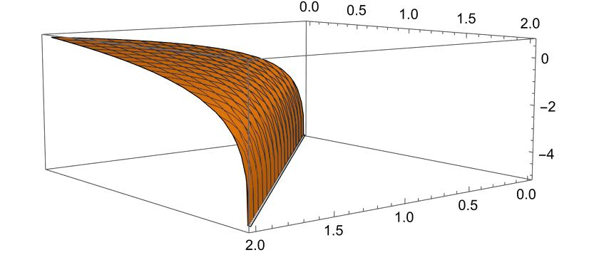
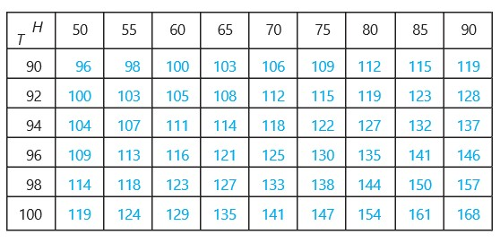

```{r setup, include=FALSE}
options(htmltools.dir.version = FALSE)
knitr::opts_chunk$set(
  fig.width=9, fig.height=3.5, fig.retina=3,
  out.width = "100%",
  cache = FALSE,
  echo = FALSE,
  message = FALSE, 
  warning = FALSE,
  hiline = TRUE
)
```

```{r xaringan-themer, include=FALSE, warning=FALSE}
library(xaringanthemer)
style_duo_accent(
  primary_color = "#000080",
  secondary_color = "#f2f3f4",
  inverse_header_color = "#00147e"
)
```

```{r xaringan-editable, echo=FALSE}
xaringanExtra::use_editable(expires = 1)
xaringanExtra::use_scribble()
```
# Goals for the session:

  * Approximate a function using a plane. <br/><br/>
  * Introduce the equation of the plane (and the Taylor polynomial). <br/><br/>
  * Describe the total derivative using this approximation. <br/><br/>

---
# Motivation

> The function $f(x,y)=\ln(x+y)$ models the height of a physiological fault in California. Because we are in a field investigation, we do not have tools to calculate the value of the height at the point $(0.3,-0.3).$ How would you approximate this height?



---
# Recall 

> Recall that my partial derivatives $f_x$ and $f_y$ are the slopes of the tangent lines to the function at $(x_0,y_0).$ Let's see these tangent lines at the point $(1,0)$ which is close to the desired point.

<iframe src="https://www.geogebra.org/classic/txd5dnqk?embed" width="1000" height="300" allowfullscreen style="border: 1px solid #e4e4e4;border-radius: 4px;" frameborder="0"></iframe>

---
# The tangent plane

> Note that if we want to know the equation of the plane $T$ tangent to $f$ at the point $(x_0,y_0),$ it necessarily has to contain all the tangent lines to the curves that pass through $(x_0,y_0,f(x_0,y_0)).$ <br/><br/>
Remember that the equation of a line is: $$z-z_0 = A(x-x_0)+B(y-y_0),$$ where $z_0=f(x_0,y_0).$ <br/><br/>
If we cut the function and the plane with the plane $y=y_0,$ we obtain that $$z-z_0=A(x-x_0)$$ and this is a tangent line to the curve.

---
# The tangent plane

> If we cut the function and the plane with the plane $x=x_0,$ we obtain that $$z-z_0 = B(y-y_0)$$ and this is a tangent line to the curve. <br/><br/>
These two tangent lines are known, we know that they have slopes $$f_x(x_0,y_0)\quad \mbox{and}\quad f_y(x_0,y_0).$$ Therefore, the equation of the tangent plane is $$z-z_0=f_x(x_0,y_0)(x-x_0)+f_y(x_0,y_0)(y-y_0).$$

---
## How we approximate with the tangent plane?

> Recall that we want to approximate the value of $\ln(0.3,-0.3)$ and for this we will use the equation of the tangent plane to $f$ at the point $(1,0).$ The partial derivatives of $f$ at $(1,0)$ are: $$f_x(1,0)=1\quad \mbox{and}\quad f_y(1,0)=-1.$$ So the tangent plane to $f$ at $(1,0)$ is: $$z-0=1(x-1)+(-1)(y-0).$$ The value of $z$ when $x=0.3$ and $y=-0.3.$ <br/><br/> Substituting in the equation of the plane we obtain: $$z=(0.3-1)+(-1)(-0.3)=-0.4.$$ So $f(0.3,-0.3)\approx -0.4.$

---
#### Example 1:

> Compute the equation of the tangent plane to $f(x,y)=2x^2+y^2$ at the point $(1,1,3).$

--


1. Find the partial derivatives of $f$ at $(1,1):$ $$f_x(1,1)=4(1)=4 \quad \mbox{y} \quad f_y(1,1)=2(1)=2.$$

<br/><br/>

2. Substituting the values of the partial derivatives and $(x_0,y_0,z_0)=(1,1,3)$ in the equation of the plane $$z-3=4(x-1)+2(y-1).$$


---

#### Example 2:

> Using the linearization of the function $f(x,y)=xe^{xy}$ approximate the value of the function at $(1.1,-0.1).$

 
--

1. Note that the point $(1,0)$ is close to $(1.1,-0.1).$ 

2. Compute the partial derivatives of $f$ at $(1,0):$ $$f_x(1,0)=1e^0+(1)(0)e^0=1\,\mbox{y}\, f_y(1,0)=(1)^2e^0=1.$$

3. Write the tangent plane: $$z-1=1(x-1)+1(y-0)=x-1+y$$

4. Aproximate $f(1.1,-0.1)$ $$z-1=1.1-1-0.1\Leftrightarrow z=0.1-0.1+1=1.$$

---

### Example 3:

> With the following table, approximate the values of the function when they are close to $(96,70).$




---

## Total Derivative

> With the equation of the tangent plane to $f$ at $(x_0,y_0)$ we can induce the value of the _total_ change of the function. Remember that the equation of the tangent plane is $$z-z_0=f_x(x_0,y_0)(x-x_0)+f_y(x_0,y_0)(y-y_0).$$ 
--
<br/><br/>
If we move closer to $(x_0,y_0)$ my increments become infinitesimal and we can rewrite them as $$dz=f_x dx + f_y dy$$ where $dx$ and $dy$ mean the increment that we have given from $(x_0,y_0)$ to $(x,y).$

---

#### Example

> Find the total derivative of $f(x,y)=x^2+3xy-y^2.$ Calculate the value of the total derivative when we change from $(2,3)$ to $(2.05,2.95).$

--

1. Find the partial derivatives of $f:$ $$f_x(x,y)=2x+3y\quad\mbox{y}\quad f_y(x,y)=3x-2y.$$

2. Express the diferencial: $$dz= f_x dx+ f_y dy =(2x+3y)dx+(3x-2y)dy$$

3. Compute the value of the total derivative: $$dz=(2(2)+3(3))(0.05)+(3(2)-2(3))(-0.05)= 0.65$$

---

#### Example 4:

> The radius of the base and the height of a circular cone have measures of $10cm$ and $25cm,$ respectively. But an error of $0.1cm$ was detected in the measurement. Use the differential to estimate the maximum possible error in the volume.