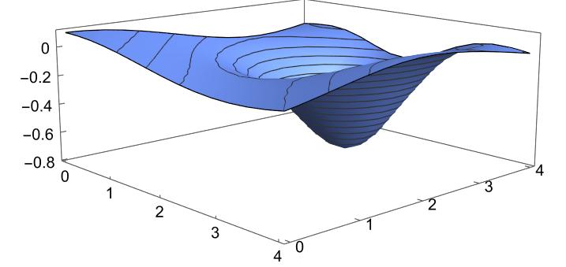

```{r setup, include=FALSE}
options(htmltools.dir.version = FALSE)
knitr::opts_chunk$set(
  fig.width=9, fig.height=3.5, fig.retina=3,
  out.width = "100%",
  cache = FALSE,
  echo = FALSE,
  message = FALSE, 
  warning = FALSE,
  hiline = TRUE
)
```

```{r xaringan-themer, include=FALSE, warning=FALSE}
library(xaringanthemer)
style_duo_accent(
  primary_color = "#000080",
  secondary_color = "#f2f3f4",
  inverse_header_color = "#00147e"
)
```

```{r xaringan-editable, echo=FALSE}
xaringanExtra::use_editable(expires = 1)
xaringanExtra::use_scribble()
```
# Goals for the session:

* We will introduce the types of extreme values and their geometry. <br/><br/>
* We will introduce the criterion to determine these. <br/><br/>
* We will model with extreme values and optimization of functions. <br/><br/>

---
# Motivation:

Assume the following function $$I(t,p)=-0.3e^{1-(t-2)^2-(p-3)^2}+0.1\cos(t+p)$$ predicts the difference between the value of the Argentine peso and the dollar, based on time and the value of the dollar. We would like to know if for a given time and a value of the dollar, this difference is the smallest possible.



---
# Local extreme values.

> **Definition:** Given a function $f(x,y),$ we say that $f(a,b)$ is an extreme value of the type if:
<br/><br/>
1. **local maximum:** $f(x,y)\leq f(a,b)$ for any $(x,y)$ near $(a,b).$ <br/><br/>
2. **local minimum:** $f(x,y)\geq f(a,b)$ for any $(x,y)$ near $(a,b).$ <br/><br/>

--

<br/><br/>
> **Theorem:** If $f$ has an extreme value at $(a,b),$ then $f_x(a,b)=0$ and $f_y(a,b)=0.$

---
# Critial Points:

> **Definition:** We say that $(a,b)$ in the domain of $f$ is a **critical point** for $f$ if $$f_x(a,b)=f_y(a,b)=0$$ or one of these does not exist.

---

#### Example:

Compute the critical points of $f(x,y)=x^2+y^2-2x+6y+14$ and $g(x,y)=y^2-x^2.$

--

1.    We derive partially and solve the equation $f_x(x,y)=0$ and $f_y(x,y)=0.$
 $$f_x(x,y)=2x-2=0\Rightarrow x=1$$
$$f_y(x,y)=2y+6=0 \Rightarrow y=-3$$
<br/><br/>

2.    We derive partially and solve the equation $g_x(x,y)=0$ and $g_y(x,y)=0.$
 $$g_x(x,y)=-2x=0\Rightarrow x=0$$
$$g_y(x,y)=2y=0 \Rightarrow y=0$$
---
# It is a maximum or minimum?

In the motivation example we would like to know if the value of the peso is the smallest possible. We can use the following theorem to determine this.

<iframe src="https://www.geogebra.org/classic/xsujgdrb?embed" width="1100" height="400" allowfullscreen style="border: 1px solid #e4e4e4;border-radius: 4px;" frameborder="0"></iframe>

---
# How to decide what type of extreme value we have?

> **Theorem:** Let $f$ be a function whose second partial derivatives are continuous near $(a,b)$ and $(a,b)$ is a critical point of $f.$ Then, let $$D=D(a,b)=f_{xx}(a,b)f_{yy}(a,b)-[f_{xy}(a,b)]^2.$$ <br/><br/> Then:
1. If $D>0$ and $f_{xx}(a,b)>0,$ then $f(a,b)$ has a local minimum at $(a,b).$ <br/>
1. If $D>0$ and $f_{xx}(a,b)<0,$ then $f(a,b)$ has a local maximum at $(a,b).$ <br/>
1. If $D<0,$ then we cannot decide. <br/>

---
#### Example 1:

For our function $$I(t,p)=-0.3e^{1-(t-2)^2-(p-3)^2}$$ determine if it has a minumum or maximum.

--
1. The critical point is $(2,3),$ since $$f_t(t,p)=0.6(t-2)e^{1-(t-2)^2-(p-3)^2}$$
$$f_p(t,p)=0.6(p-3)e^{1-(t-2)^2-(p-3)^2}$$
2. My discriminant at $(2,3)$ 

$$D(2,3)=\det\left(\begin{array}{cc} I_{tt}(2,3) & I_{tp}(2,3)\\ 
I_{tp}(2,3) & I_{pp}(2,3) \end{array}\right)=
\det\left(\begin{array}{cc} 1.63 & 0 \\ 0 & 1.63 \end{array}\right) = 2.66$$

Following the criterium, we have a minimum.

---
# Optimization

> We want to produce a box with a carton board of 12 $m^2$ and we want to maximize the volume of the box. What are the dimensions of the box?
--

1. We need to determine the objective function: $$V(x,y,z)=xyz$$ but $2xz+2yz+xy=12$ by hypothesis, then $$z=\frac{12-xy}{2(x+y)}$$
2. We find the critical points:  
$$V_x=\frac{y^2(12-2xy-x^2)}{2(x+y)^2}\quad V_y=\frac{x^2(12-2xy-y^2)}{2(x+y)^2}$$

---
Those partial derivatives are zero when: $$12-2xy-x^2=0$$ $$12-2xy-y^2=0.$$

Those equations imply that $x^2=y^2,$ and as they are measured then $x=y.$ Then $$12-3x^2=0\Rightarrow x=y=2$$ and $$z=\frac{12-(2)(2)}{2(2+2)}=1.$$
