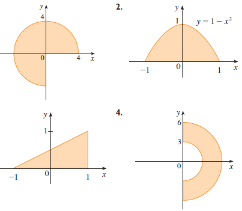

```{r setup, include=FALSE}
options(htmltools.dir.version = FALSE)
knitr::opts_chunk$set(
  fig.show =('asis'),
  dev='png',
	message = FALSE,
	warning = FALSE,
	cache = FALSE,
	hiline = TRUE,
	out.width = "90%"
)
```

```{r xaringan-themer, include=FALSE, warning=FALSE}
library(xaringanthemer)
style_duo_accent(
  primary_color = "#000080",
  secondary_color = "#f2f3f4",
  inverse_header_color = "#00147e"
)
```

```{r xaringan-editable, echo=FALSE}
xaringanExtra::use_editable(expires = 1)
xaringanExtra::use_scribble()
```
# Goals for the session

 * Know the definition of polar coordinates. <br/><br/>
 * Establish the change of coordinates identities. <br/><br/>
 * Show how the integral is affected in this new coordinate system.

---
# Motivation
 ### Polar coordinates in $\mathbb{R}^2.$
<iframe src="https://www.geogebra.org/calculator/aubzbhsd?embed" width="1200" height="400" allowfullscreen style="border: 1px solid #e4e4e4;border-radius: 4px;" frameborder="0"></iframe>

---
# Change of Variables


> If we have a point $(x,y)$ in $\mathbb{R}^2$ then the following holds: <br/><br/>
  * $r=\sqrt{x^2+y^2}$ and $\tan(\theta)= \frac{y}{x}.$ <br/><br/><br/>
  * $x=r\cos(\theta)$ and $y=r\sin(\theta)$

---
## Express Polar Regions


> Given the following regions determine if they are polar regions or not.



---
# The Area Differential in the new system

> Compute the area of the region bounded by the $x-$axis and the curve $f(x)=\sqrt{1-x^2}$ using polar coordinates.


---
# Adapting the Area differential

From the previous example we have that the area is given by $$\int\int_R dxdy=\int\int_R rdrd\theta.$$

> Recompute the area using this adapted differential.

---
# Example:

> Compute the value of the integral of $f(x,y)=e^{x^2+y^2}$ in the positive half of the unit circle.

---
# Example:

> Compute the value of the integral of $f(x,y)=e^{x^2+y^2}$ in the positve hakf of the unit circle.

$$\int\int_R e^{x^2+y^2}=\int_0^\pi\int_0^1 e^{r^2} rdrd\theta =\int_0^\pi \left[\frac{1}{2}e^{r^2}\right]_0^1 d\theta = \frac{\pi(e-1)}{2}.$$

---
# Practice:

> Compute the integral of $f(x,y)=x$ in the first cuadrant of the disk of radius $a.$

---
# Why is it better to calculate the integral with a change of variable?

> Using Rectangular coordinates, find the value of the integral $$\int_0^1\int_0^{\sqrt{1-x^2}}x^2+y^2 dydx.$$


---

 $C=\{(r,\theta): 0\leq r\leq 1, 0\leq \theta \leq \frac{\pi}{4}\}.$ Por lo que la integral es: $$\int_0^1\int_0^{\pi/4} (r\cos(\theta))^2+(r\sin(\theta))^2 rd\theta dr=\int_0^1\int_0^{\pi/4}r^3d\theta\ dr =\left.\frac{\pi}{4}\frac{r^4}{4}\right|_0^1=\frac{\pi}{4}.$$

---
# Example:

> Find the volume of the solid region above the unit circle and below the paraboloid $z=9-x^2-y^2.$

---
# Example

> Find the volume of the solid region below $z=4$ and above $z=x^2+y^2$ 


