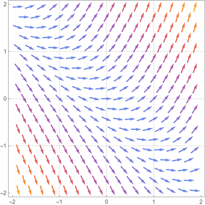
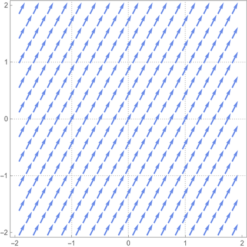
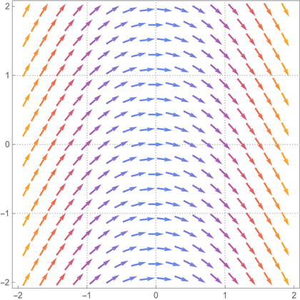
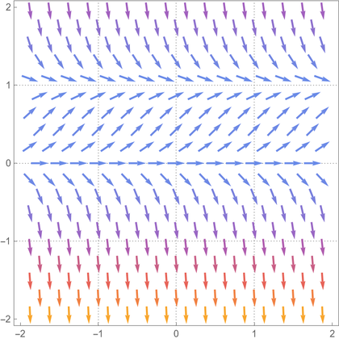

```{r setup, include=FALSE}
options(htmltools.dir.version = FALSE)
knitr::opts_chunk$set(
  fig.width=5, fig.height=3, fig.retina=3,
  out.width = "60%",
  cache = FALSE,
  echo = FALSE,
  message = FALSE, 
  warning = FALSE,
  hiline = TRUE
)
```

```{r xaringan-themer, include=FALSE, warning=FALSE}
library(xaringanthemer)
style_duo_accent(
  primary_color = "#000080",
  secondary_color = "#f2f3f4",
  inverse_header_color = "#00147e"
)
```

```{r xaringan-editable, echo=FALSE}
xaringanExtra::use_editable(expires = 1)
xaringanExtra::use_scribble()
```

```{r xaringan-logo, echo=FALSE}
xaringanExtra::use_logo(
  image_url = "https://github.com/alxcn/TecLogoEIC/blob/9562a53875418e749a296c85808a19c85fc4be74/IngenieriaCiencias_Horizontal_RGB.png",
  position = xaringanExtra::css_position(top = "2em", right = "2em")
)
```
# Objetivos de la Sesión

* Construir el campo de pendientes para una EDO. <br/><br/>
* Conocer las curvas solución y su clasificación. <br/><br/>
* Inferir desde la EDO sin resolverla. <br/><br/>

---
# Campo de Pendientes

Consideremos la siguiente EDO $y'=f(x,y).$
--

> __Definición:__ El _campo de pendientes_ de la EDO $y'=f(x,y)$ se construye con una representación de una recta con pendiente $f(x,y)$ en cada punto $(x,y).$ <br/>

##### Ejemplo:
Consideremos la EDO $y'=x+y.$ 

---
##### Ejemplo:

> Consideremos las EDOs $y'=2$ 
--


---
> Consideremos las EDOs $y'=-x$ 
--

---
# Curvas solución

> Consideremos la EDO $y'=4y(1-y),$ y estudiemos su campo de pendientes:
--


> Las curvas solución son las curvas que siguen la dirección de las pendientes del campo de pendientes.


---
## Tipos de Curvas Solución:

> __Definición:__ Sea $y=f(x,y)$ una EDO y $c$ una curva solución. Diremos que la curva es un _equilibrio_ si $y(t)$ es una solución constante de la EDO. La curva solución es _estable_ si con el tiempo se acerca a un equilibrio, y es _inestable_ si se aleja de un equilibrio. <br/><br/>

--
##### ¿Cuántos equilibrios tiene la EDO $y'=4y(1-y)$?

---
##### Ejemplo:

> Supongamos que tenemos la EDO de mezclas $$S'=\frac{2000-3S}{100}.$$ Analicemos sus posibles curvas solución:


