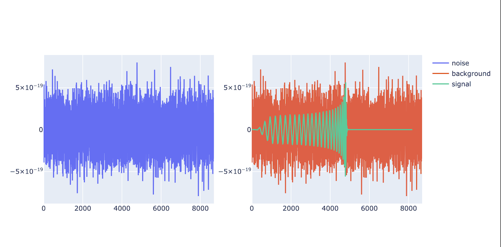
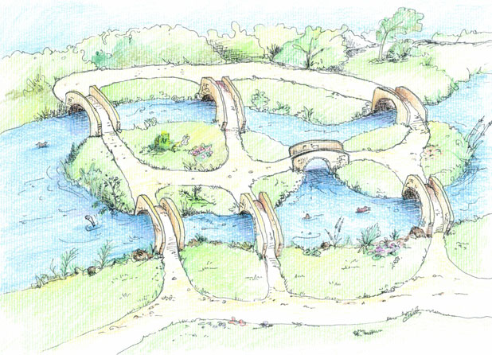
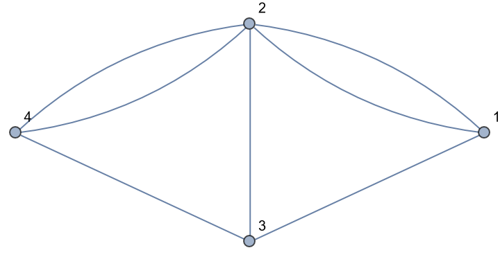

```{r setup, include=FALSE}
options(htmltools.dir.version = FALSE)
knitr::opts_chunk$set(
  fig.width=5, fig.height=3.5, fig.retina=3,
  out.width = "40%",
  cache = FALSE,
  echo = FALSE,
  message = FALSE, 
  warning = FALSE,
  hiline = TRUE
)
```

```{r xaringan-themer, include=FALSE, warning=FALSE}
library(xaringanthemer)
style_duo_accent(
  primary_color = "#000080",
  secondary_color = "#f2f3f4",
  inverse_header_color = "#00147e"
)
```

```{r xaringan-editable, echo=FALSE}
xaringanExtra::use_editable(expires = 1)
xaringanExtra::use_scribble()
```

```{r xaringan-logo, echo=FALSE}
xaringanExtra::use_logo(
  image_url = "https://github.com/alxcn/TecLogoEIC/blob/9562a53875418e749a296c85808a19c85fc4be74/IngenieriaCiencias_Horizontal_RGB.png",
  #position = xaringanExtra::css_position(top = "2em", right = "2em")
)
```

# Equipo de Profesores:

- Dr. Alejandro Ucan Puc (alejandro.ucan-puc@tec.mx) profesor de Módulos
- [Dr. Lilia Alanís López](https://sites.google.com/tec.mx/liliaalanislopez) (lilia.alanislpz@tec.mx) profesora de Reto.

## Reto y Socio Formador:

- Gisel Solis Bonilla, [SLB México](https://www.slb.com/)
- Uso de Geometría y Topología para la Optimización de Consumo de Combustible.

---
# ¿Para que sirve la Geometría y Topología en Ciencia de Datos?

Sabemos que los datos, por más complejos que sean o que se encuentren en dimensiones altas, cuentan con una _forma (geometría/topología)_ intrínseca, y entender esta forma nos ayuda a determinar el proceso más adecuado para trabajar con ellos. Por ejemplo:

```{r,out.width="70%",fig.align="center",fig.cap="Señales de ruido y señal verdadera."}

```


---
## ¿Cómo clasificarías las señales anteriores?

--
- ¿Por su forma?
- ¿Por su frecuencia?
- ¿Por su amplitud?


---
## Usando técnicas Topológicas:

```{r,mix-b, out.width="30%",fig.align="center",fig.cap=c("Señal ruidosa","Señal verdadera")}
img<-c("noisy_signal.png","true_signal.png")
knitr::include_graphics(img)
```
---
# ¿Qué es __Topological Data Analysis (TDA)__?

> Es una rama de la ciencia de datos que utiliza herramientas topológicas y geométricas para estudiar y analizar datos. <br/>

--

## Un poco de historia

El TDA comenzó a principios de los años 2000's con los trabajos pioneros de:

  * [Edelsbrunner et. al. (2002)](https://link.springer.com/article/10.1007/s00454-002-2885-2): Topological Persistence and Simplification  <br/><br/>
  * [Zomorodian and Carlsson (2005)](https://link.springer.com/article/10.1007/s00454-004-1146-y): Computing Persistent Homology
  
con trabajos relacionados con __homología persistente__ (tema clave que veremos más adelante).


> El TDA proporciona métodos matemáticos, estadísticos y algorítmicos para analizar y explotar propiedades topológicas-geométricas de un data set (nubes de puntos en el espacio euclideano o espacios más generales.)

---
## Actualmente

Actualmente el TDA se ha consolidado y estandarizado, que contamos con algunos paquetes que nos ayudarán a aplicar los conceptos teóricos, como son: <br/><br/>
  * [Gudhi](https://www.gudhi.inria.fr/) <br/>
  * [Dionysus](https://www.mrzv.org/software/dionysus/) <br/>
  * [Simplicial](https://simplicial.readthedocs.io/en/latest/) <br/>
  * [Persim](https://persim.scikit-tda.org/en/latest/) <br/>
  * [Giotto-tda](https://giotto-ai.github.io/gtda-docs/) 

---
## Axiomas del TDA

1. Asumimos que nuestro dataset es finito, y que siempre se puede asociar con una noción de distancia entre los puntos (distancia de espacio métrico o matriz de distancias). <br/><br/>

1. Siempre podemos construir un objeto "continuo" asociado al dataset (complejo simplicial o filtración). <br/><br/>

1. La información topológica de nuestro dataset proviene del objeto continuo (triangulaciones, homología). <br/><br/>

1. Con la información topológica podemos proveer nuevas propiedades (topológicas o geométricas) del dataset (visualización).


---
# ¿Qué es _forma_?

> Entendemos por _forma_ a la estructura de un objeto/espacio sin necesidad de mediciones. <br/><br/>
La __topología__ es la rama de las mátematicas que estudia las propiedas intrínsecas de una espacio (_espacios topológicos_) que son preservadas bajo ciertas transformaciones (_homeomorfismos_).

```{r, out.width="40%",fig.align="center",fig.cap="Lo mismo"}
knitr::include_graphics("cube_sphere.png")
```

---
# ¿Topología?

- Geometría: Euclides y sus elementos.
- Topología: Johann Benedict Listing (1847) y su trabajo sobre la topología de los nudos.
- Topología Algebraica: Poincaré y su trabajo sobre la topología de las variedades.


---
# El problema de los Puentes de Köningsberg y Leonard Euler.


```{r, out.width="50%",fig.align="center",fig.cap="Köningsberg"}

```
---
## Solución

```{r, out.width="50%",fig.align="center",fig.cap="Grafo"}

```

---
# Contribuciones

> Podemos mencionar a: <br/><br/>
  - August Möbius. <br/><br/>
  - Georg Cantor. <br/><br/>
  - Maurice Fréchet, Schoenflies, Felix Hausdorff.
  - Poincaré, Perelman, Thurston, etc.